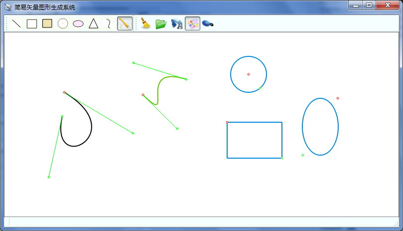

# SimplyVectorGraphicsGenerationSystem

https://www.linux-apps.com/p/1131112/

1. The use of object-oriented thinking design CShape base class, the derived class by CShape triangle class, class oval, rectangular and circular standard classes and class curve (Bezier), basic graphic design is based on a simple vector graphics generation systems.
2. The design of the system interface, the mouse and keyboard message handling, the use of the constructed class to design a simple vector graphics generation system.
3. According to the characteristics of vector graphics, vector image preservation and realization of open vector function.

